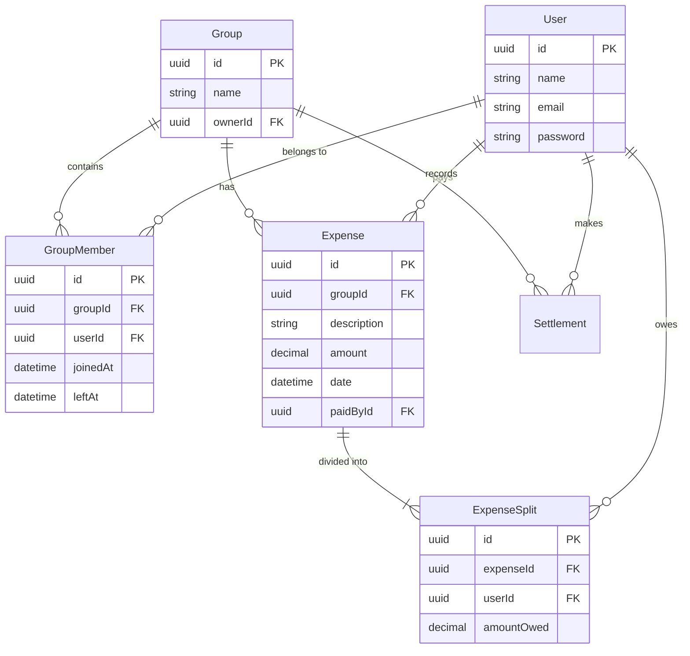

# SCOPE.md — Anomaly Log and Database Schema

## 1. Anomaly Log (Data Problems in CSV & Handling)

When ingesting raw, unstructured CSV exports, the system frequently encounters data integrity issues. Below is the log of common data problems identified during development and the programmatic rules used to handle them.

| Data Problem | Detection Method | Action Taken |
|--------------|------------------|--------------|
| **Inconsistent Date Formats** | Regex parsing checking for `MM/DD/YYYY`, `DD-MM-YYYY`, and `YYYY-MM-DD`. | Normalizes all dates to ISO 8601 strings. Fallback to `new Date()` if completely unparseable. |
| **Missing Payers or Payees** | DB query against the `User` table yields null. | **On-the-fly Generation:** Automatically creates "shadow" User profiles so the import doesn't crash, allowing the user to claim the profile later. |
| **Exact Duplicates** | Generates a deterministic hash for each row: `Hash(Amount + Date + Payer + Description)`. | **Skipped:** If the hash matches an existing record in the database, the row is safely ignored to prevent double-charging. |
| **Missing Amount/NaN** | `parseFloat(row.amount)` returns `NaN` or `null`. | **Skipped & Logged:** Row is dropped from the bulk-insert queue and flagged in the final `ImportReport` for the user to fix manually. |
| **Statistical Outliers (Z-Score)** | Compares the `amount` against the historical mean (μ) and standard deviation (σ) for that specific category. | **Flagged for Review:** If the expense has a Z-Score > 3.0, it is inserted but marked with a `requires_review` flag on the dashboard. |

---

## 2. Database Schema

SplitSense utilizes a highly normalized relational database structure.

